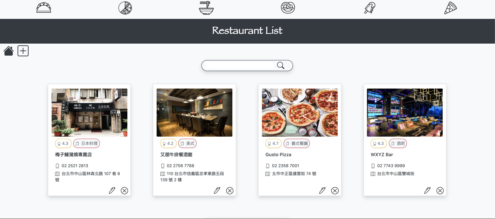
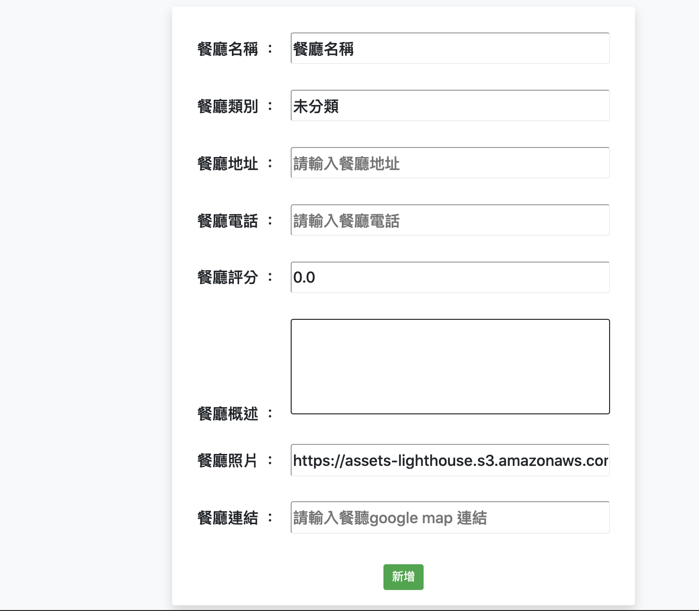
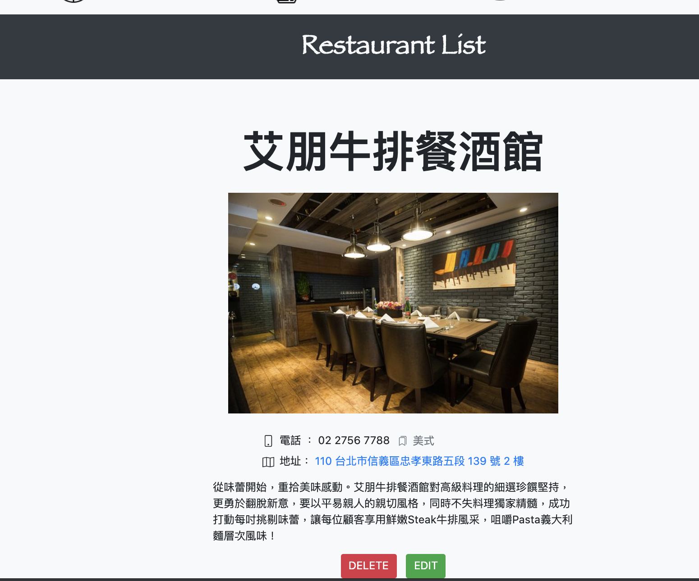

# Restaurant List 2

一個簡單的餐廳蒐集清單app，可以將喜歡的餐廳資訊放入清單中





## 安裝

- 開啟終端機，輸入
```
git clone https://github.com/marcho001/RestaurantList2.git
```
- 進入資料夾安裝套件
```
npm install
```
- 執行種子程式
```
npm run seed
```
- 執行程式
```
npm run dev
```

## 功能

- 瀏覽收集的餐廳
- 可以搜尋餐廳的中文名字、評分、分類
- 可以點進餐廳看更多介紹
- 可以新增一間自己喜歡的餐廳
- 可以刪除不要的餐廳
- 可以編輯一間餐廳資訊

## 工具
- Node.js
- Express
- Express-handlebars
- Bootstrap
- ICONS8
- body-parser
- Mongodb
- Mongoose